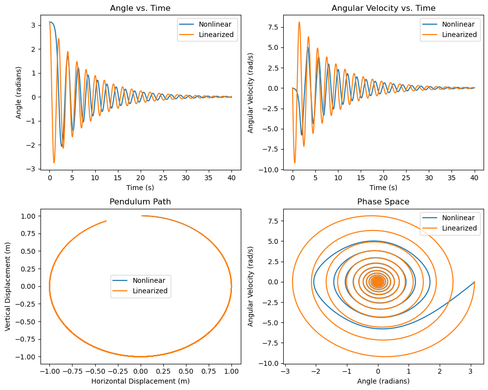
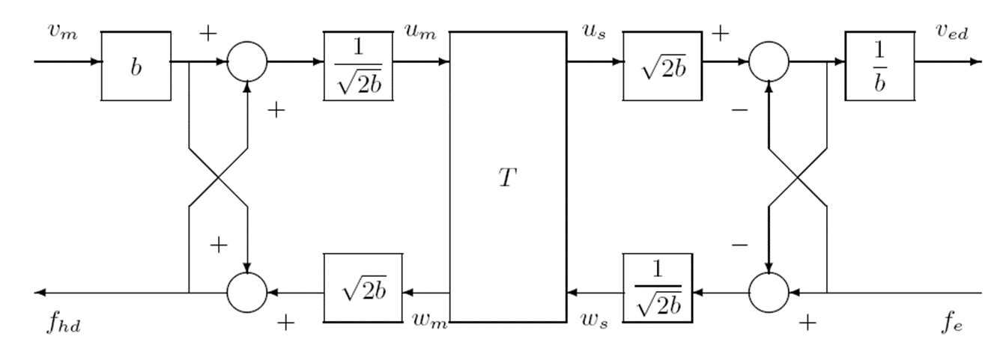
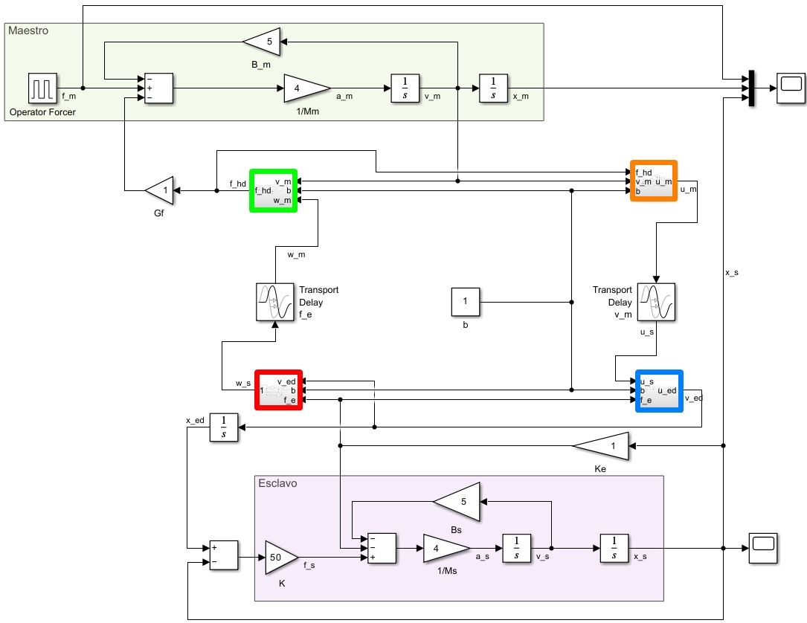
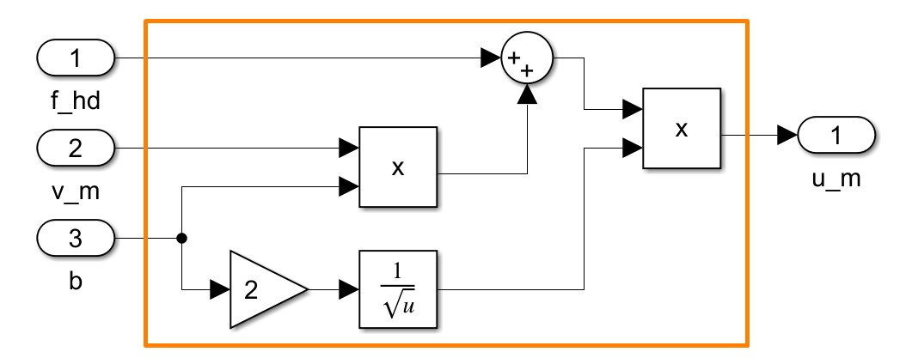

# MUAR

MUAR (derived from the Spanish: Máster en Automática y Robótica) compiles the key assignments for the 2023-24 academic year within the **Master's in Robotics** program at the Polytechnic University of Madrid.

## Content
**[1. Maths](#1-maths)**

* [1.1. Graphs](#11-graphs)
    
**[2. Advanced Programming](#2-advanced-programming)**

**[3. Nonlinear Systems](#3-nonlinear-systems)**
 
* [3.1. Pendulum](#31-pendulum)

**[4. Human-Robot Interaction](#4-human-robot-interaction)**
* [4.1 Bilateral Control with Wave Variables](#41-bilateral-control-with-wave-variables)

## 1. Maths

### 1.1 Graphs

Solutions to common graph problems implemented using the `NetworkX` Python library within `Jupyter Notebooks`. The following problems are addressed:

- **TSP (Traveling Salesman Problem)**: Finding the shortest possible route that visits a given set of cities and returns to the starting city.
- **CPP (Chinese Postman Problem)**: Determining the shortest possible route that visits every edge of a graph at least once.
- **SPP (Shortest Path Problem)**: Calculating the shortest path between two nodes in a graph.
- **MST (Minimum Spanning Tree)**: Finding the minimum spanning tree of a connected, undirected graph.

#### Folder Structure

- **Data**: This folder contains datasets for four large graphs used.
- **src.ipynb**: The main Jupyter Notebook file that contains the Python code for solving the graph problems.
- **Assignment_guide.pdf**: Detailed instructions and descriptions for the graphs used.
- **Graphs_Problems.pdf**: Presentation slides.

Finally, an example of the TSP solution for a graph with 100 nodes.

## 2. Advanced Programming
Visit [my C-advanced repo](https://github.com/jbarciv/C-advanced) for full code and execution instructions.
Content:
- Pipes
- Queues
- Shared memory
  - Busy waiting
- Semaphores
- Threads

## 3. Nonlinear Systems

### 3.1 Pendulum
**_A Theoretical and Empirical Analysis of Nonlinearities in a Simple Pendulum_**

In this study, we conduct a theoretical and empirical analysis of the nonlinearities exhibited by a simple pendulum. The simulation is executed utilizing the fourth-order Runge-Kutta method, and a 3D simulation is generated with the aid of VPython. By venturing away from the stable point of linearization, we can vividly observe how the linearized systems diverge from the actual behavior.

## 4. Human Robot Interaction

### 4.1 Bilateral Control with Wave Variables
Stability Analysis for a Bilateral Control System with and without Wave Variables (WV). By incorporating passivity control through WV, it is possible to mitigate the destabilizing effects of delays. In this study, we conduct a parametric analysis and quantify the impact of delays on the system's stability.

The WV system schematic used corresponds to the next figure(from this source: [1])

And has been implemented with Simulink (Matlab):
 where orange box, for example, can be implemented as follows:

## References

**[1] S. Hirche, M. Ferre, J. Barrio, C. Melchiorri, and M. Buss, "Bilateral Control Architectures for Telerobotics," in Advances in Telerobotics, M. Ferre, M. Buss, R. Aracil, C. Melchiorri, and C. Balaguer, Eds. Springer Berlin Heidelberg, Berlin, Heidelberg, 2007, pp. 163-176.**
*DOI*: [10.1007/978-3-540-71364-7_11](https://doi.org/10.1007/978-3-540-71364-7_11)

